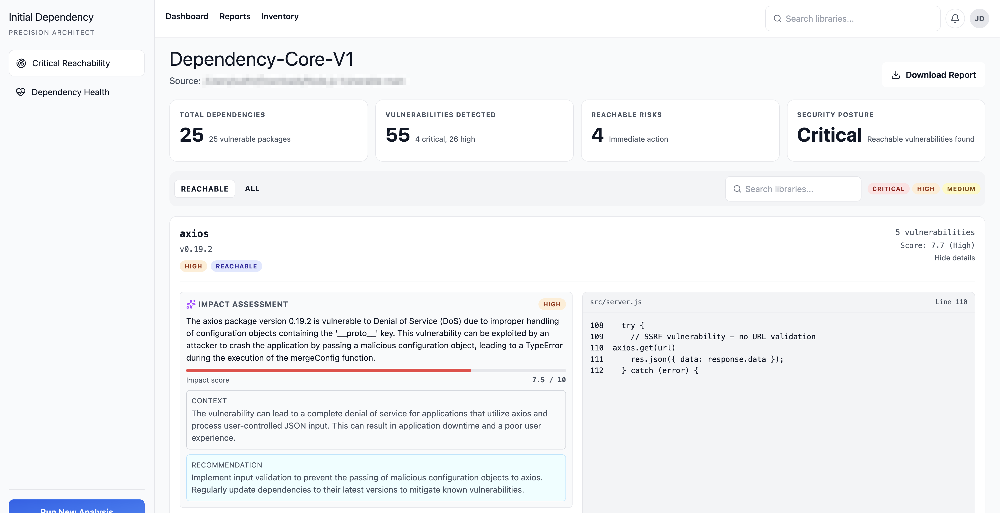

# AskMe

Monorepo for AI assisted Source Code analysis tools and experiments.

## Objective

Analyze a source project for vulnerable dependencies and produce actionable, context-aware insights (what is vulnerable, where it is used, and likely impact).



## How it works!

- `apps/askme-server`: NestJS API that exposes vulnerability scan services.   
   - scans dependencies (OSV) [google/osv-scanner](https://github.com/google/osv-scanner)
   - extracts code usage context (AST) [tree-sitter](https://www.npmjs.com/package/tree-sitter),
   - Enriches vulnerabilities with impact analysis. Basic RAG using CVE advisories embeddigns and code snippets of exposed code snippet (Chroma + OpenAI).
- `apps/askme-app`: Astro UI for presenting vulnerability reports.

## Requirements

- Node.js `>=22.12.0`
- Redis (default `redis://localhost:6379`)
- ChromaDB (default `http://localhost:8000`)
- OpenAI API key (`OPENAI_API_KEY`)
- OSV Scanner binary available locally (configured via `OSV_SCANNER_PATH`). And its executable.
   Check [google/osv-scanner/releases](https://github.com/google/osv-scanner/releases) for available binaries for your platform

## Run Locally

1. Install dependencies from repo root:
   ```bash
   pnpm install
   ```

1. Configure backend env:
   ```bash
   cp apps/askme-server/.env.example apps/askme-server/.env
   ```
   Update values in `.env` (especially `OPENAI_API_KEY` and `OSV_SCANNER_PATH`).

1. Start docker services
   ```bash
   docker compose up -d
   ```

1. Download OSV Scanner binary. Configured .env `OSV_SCANNER_PATH` to downloaded binary.  
   Check [google/osv-scanner/releases](https://github.com/google/osv-scanner/releases) for available binaries for your platform
   Make sure its executable
   ```bash
   chmod +x osv-scanner_darwin_arm64-v2.3.3
   ```

1. Start apps:
   ```bash
   pnpm run dev
   ```
   starts frontend and backend dev services
   - Frontend: `http://localhost:4321`
   - API: `http://localhost:3000`

