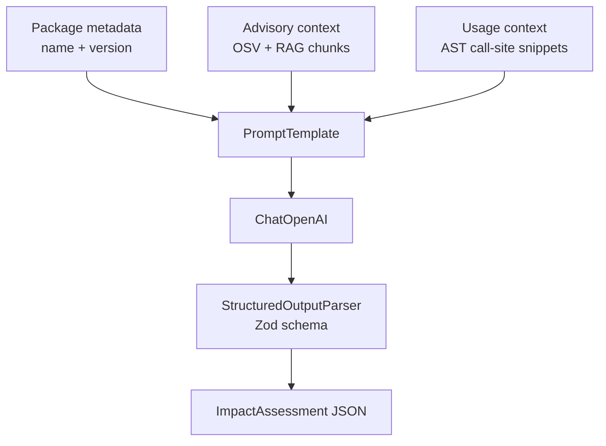

# Impact Analysis

How this project uses AI to estimate the impact of dependency vulnerabilities in the current codebase.

## Components

- **Vulnerability input**: package metadata, vulnerability records, and advisory details from OSV.
- **Usage input**: AST-derived call-site snippets showing where the package is used in source code.
- **Advisory enrichment**: vector-store retrieval of advisory chunks (RAG context).
- **LLM chain**: `PromptTemplate -> ChatOpenAI -> StructuredOutputParser`.
- **Output contract**: Zod-validated JSON (`summary`, `remediation`, `impactScore`, `impactLevel`, etc.).
- **Fallback path**: heuristic impact assessment when AI is unavailable or fails.

## LangChain Inputs and Output

ref: [vulnerability-scan.service.ts](apps/askme-server/src/vulnerability-scan/vulnerability-scan.service.ts)

## Notes

- The model runs at temperature `0` for more deterministic responses.
- Prompt instructions require JSON-only output in a strict schema.
- If parsing/model execution fails, the service logs a warning and returns fallback scoring.

## Current Limitations

- Single-pass LLM inference: no self-check/reranking, so hallucinated or shallow reasoning can pass.
- Prompt truncation by design: only limited snippets/chunks are included; can miss important exploit paths.
- No explicit exploitability model: score is generated by LLM judgment, not tied to formal reachability/proof.
- Fallback is coarse: heuristic score (usage/advisory presence) is useful but low fidelity.
- Potential stale context: impact quality depends on vector-store chunk quality and freshness.

## Future Work to Improve Results

- Add a two-stage pipeline: draft assessment + verifier model that checks claims against supplied evidence.
- Introduce confidence + evidence fields (e.g., "claims must cite snippet/advisory IDs").
- Add deterministic scoring features (reachability, runtime exposure, auth boundary, internet-facing path) and combine with LLM narrative.
- Improve retrieval: semantic + keyword hybrid, dedupe, and prioritize chunks tied to vulnerable functions/APIs.
- Add regression evals with known CVE/project fixtures to measure score consistency and reduce drift.
- Cache and compare prior assessments to detect large unexplained score swings between runs.